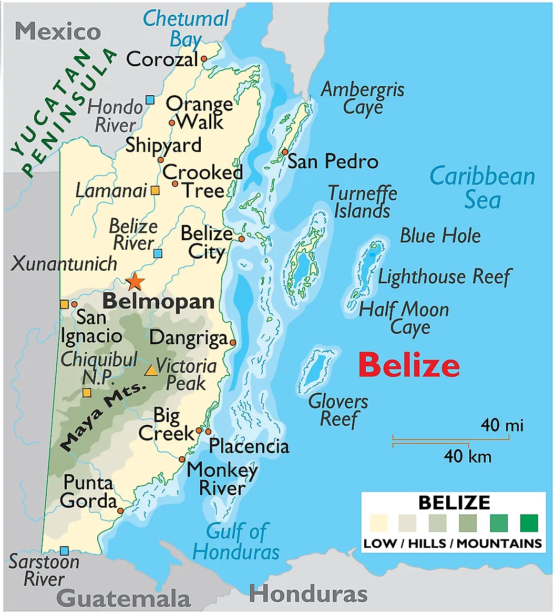

## **TLDR: April – June ideal, avoid September – October**

Divers looking for accessibility and variety should stay in **Ambergris Caye**, while those wanting **pristine, high-energy sites** should opt for **Turneffe Atoll or a liveaboard**. **Placencia** is best for divers targeting **whale sharks**. The best overall diving conditions are in **April – June and November – January**, while **September – October should be avoided due to hurricanes**.

- **Best Diving Months:** **April – June & November – January** (best visibility, marine life activity, and calmest seas).
- **Best for Whale Sharks:** **March – June** (Gladden Spit offers the best chances for sightings).
- **Peak Diving Season:** **November – May** (dry season, optimal conditions for reef and atoll diving).
- **Avoid:** **September – October** (hurricane season, potential for rough seas and low visibility).
- **Top Sites:** **The Great Blue Hole, Half Moon Caye Wall, The Elbow (Turneffe Atoll), Hol Chan Marine Reserve, Gladden Spit (for whale sharks), and Glover’s Reef Atoll.**
- **Best for Beginners:** **Hol Chan Marine Reserve, Ambergris Caye, and Caye Caulker.**
- **Best for Advanced Divers:** **The Elbow (Turneffe Atoll), Lighthouse Reef, and The Great Blue Hole.**
- **Best Resort-Based Locations:** **Ambergris Caye (convenience), Turneffe Atoll (best diving access), Placencia (whale sharks & off-the-beaten-path).**
- **Best Liveaboard Route:** **Turneffe Atoll, Lighthouse Reef, and Southern Barrier Reef (for remote, top-tier diving).**
- **Marine Life Highlights:** **Sharks (reef, nurse, occasional hammerheads), whale sharks, eagle rays, sea turtles, vibrant coral reefs, and macro critters.**

## **Orientation**

Belize is a **hybrid dive destination**, offering both **resort-based diving** and **liveaboard trips**. The country is home to the **Mesoamerican Barrier Reef**, the second-largest barrier reef in the world, as well as **atoll diving**, making it a top-tier dive destination for both beginner and advanced divers.

For **first-time visitors**, a **stay on Ambergris Caye or Caye Caulker** offers the best mix of convenience, good diving, and island life. **Serious divers** should consider **Turneffe Atoll resorts or a liveaboard** for the most diverse and exciting underwater experiences. If **whale sharks or remote reefs** are a priority, **Placencia and Southern Belize** are the best choices.

### **Choosing Between Resort-Based & Liveaboard Diving**
- **Resort-Based Diving:** Ideal for those who want easy access to day dives and a mix of land-based activities, including Mayan ruins and jungle adventures.
- **Liveaboard Diving:** Best for divers who want to explore **Turneffe Atoll, Lighthouse Reef, and the famous Blue Hole** without the travel time associated with day trips.

### **Key Diving Regions in Belize**
Belize’s diving can be broken down into three primary regions: **The Northern Cayes, Central Atolls, and Southern Belize.**

### **1. Northern Cayes (Ambergris Caye & Caye Caulker)**
- **Why Go?** The most developed and accessible part of Belize for diving, offering easy boat access to the barrier reef and Hol Chan Marine Reserve.
- **Best For:** Beginner divers, those looking for a mix of diving and nightlife, and travelers who want a lively island atmosphere.
- **Notable Spots:** Hol Chan Marine Reserve (sharks, turtles, groupers), The Aquarium (colorful coral and reef fish), Tackle Box Canyon (canyons and swim-throughs).
- **Drawbacks:** Most dive sites are within the barrier reef and don’t offer the **big pelagic action** found at the outer atolls.

### **2. Central Atolls (Turneffe Atoll, Lighthouse Reef & The Blue Hole)**
- **Why Go?** This region offers **the best diving in Belize**, including deep walls, shark encounters, and world-famous dive sites like the Great Blue Hole.
- **Best For:** Advanced divers, liveaboard travelers, and those looking for **remote, pristine diving**.
- **Notable Spots:**
  - **Great Blue Hole** (100m+ deep sinkhole, stalactites, occasional reef sharks).
  - **Half Moon Caye Wall** (colorful coral, eagle rays, reef sharks).
  - **The Elbow (Turneffe Atoll)** (strong currents, big pelagic species, schooling jacks, and snappers).
- **Drawbacks:** Requires a **long boat ride** from the mainland (2-3 hours) unless staying at a dive lodge on Turneffe Atoll.

### **3. Southern Belize (Placencia & Glovers Reef Atoll)**
- **Why Go?** Less crowded, featuring **whale sharks (seasonal), pristine reefs, and remote cayes**.
- **Best For:** Divers seeking **off-the-beaten-path locations**, whale shark encounters (March–June), and **day trips to Glovers Reef or Turneffe**.
- **Notable Spots:**
  - **Gladden Spit (Placencia)** – Seasonal whale shark encounters.
  - **South Water Caye Marine Reserve** – Excellent coral formations, abundant marine life.
  - **Glover’s Reef Atoll** – Remote and pristine, great for drift diving.
- **Drawbacks:** Fewer dive shops, requiring longer boat rides to some of the best sites.

### **Liveaboard Routes in Belize**
Liveaboards in Belize generally follow two main itineraries:
1. **The Atolls Expedition:** Covers **Turneffe Atoll, Lighthouse Reef, and Half Moon Caye**, offering **wall diving, pelagic encounters, and the Blue Hole**.
2. **Southern Barrier Reef & Glovers Reef:** Focuses on **more secluded reef systems**, **whale shark encounters (March–June), and fewer boats at the dive sites**.

### **Where to Stay for Resort-Based Diving**
If you prefer a land-based diving experience, here are the best **stay locations**:
- **Ambergris Caye:**
  - Ramon’s Village Resort (full-service dive resort with beachfront accommodations).
  - Victoria House Resort & Spa (luxury resort with diving access to Hol Chan Marine Reserve).
- **Turneffe Atoll:**
  - Turneffe Island Resort (upscale all-inclusive dive lodge on a private island).
  - Blackbird Caye Resort (dive-focused retreat with direct access to Turneffe sites).
- **Placencia:**
  - Turtle Inn (luxury eco-resort with diving excursions to Gladden Spit and South Water Caye).
  - Belize Ocean Club (mid-range option with access to whale shark tours).

## **Where to Stay, Attractions & Activities, and Food & Dining in Belize**

### **Where to Stay**
Belize offers a mix of accommodations, from luxury resorts to dive lodges and budget stays. Many resorts have house reefs for easy snorkeling and diving access.

#### **Luxury Resorts with Dive Access**
1. **Turtle Inn (Placencia) – Luxury Eco-Resort**
   - **Why Stay?** Upscale beachfront resort with excellent diving access to Gladden Spit & Silk Cayes.
   - **Features:** Private villas, on-site dive center, gourmet dining.
   - **Best For:** Couples, honeymooners, divers seeking high-end comfort.
   - **Proximity to Dive Sites:** Direct access to whale shark diving.

2. **Turneffe Island Resort (Turneffe Atoll) – Exclusive Dive Retreat**
   - **Why Stay?** A private island resort focused on diving, with easy access to The Elbow & Turneffe sites.
   - **Features:** All-inclusive, top-tier dive operation, remote location.
   - **Best For:** Serious divers, honeymooners, private getaways.
   - **Proximity to Dive Sites:** Direct access to some of Belize’s best dive sites.
   - **Cost:** Expect to spend around $3k/week per person

#### **Mid-Range & Boutique Dive Resorts**
3. **Blackbird Caye Resort (Turneffe Atoll)**
   - **Why Stay?** Comfortable oceanfront cabanas with an on-site dive shop and full dive packages.
   - **Best For:** Divers seeking an immersive reef experience away from crowds.
   - **Proximity to Dive Sites:** Near Lighthouse Reef and Turneffe’s top sites.

4. **Sunbreeze Hotel (Ambergris Caye)**
   - **Why Stay?** Conveniently located near San Pedro with easy access to Hol Chan Marine Reserve and Blue Hole trips.
   - **Best For:** Casual divers, groups, and families.
   - **Proximity to Dive Sites:** Short boat ride to Hol Chan, day trips to Turneffe and Lighthouse Reef.

5. **Belize Ocean Club (Placencia)**
   - **Why Stay?** Spacious suites, great for groups, with access to whale shark diving in season.
   - **Best For:** Families, dive groups, snorkelers.
   - **Proximity to Dive Sites:** Near Placencia’s top reefs.

#### **Budget-Friendly Options**
6. **Go Slow Guesthouse (Caye Caulker)**
   - **Why Stay?** Affordable and social hostel with direct access to snorkeling and local dive operators.
   - **Best For:** Backpackers, budget travelers, social divers.
   - **Proximity to Dive Sites:** Close to Hol Chan and day trip operators.

7. **Drift Inn (San Pedro, Ambergris Caye)**
   - **Why Stay?** Affordable lodging near San Pedro town with dive shop partnerships.
   - **Best For:** Budget-conscious divers who want comfort and access to top sites.

### **Top Attractions & Activities (Non-Diving)**
Even for non-divers, Belize offers an array of activities, from jungle adventures to Mayan ruins.

#### **1. The Great Blue Hole Scenic Flight**
   - **Why Go?** Experience the Blue Hole from above for an awe-inspiring aerial view.
   - **Best Location:** Departures from San Pedro or Belize City.
   - **Best Season:** Year-round, clear skies are ideal.

#### **2. Mayan Ruins: Xunantunich & Caracol**
   - **Why Go?** Explore Belize’s rich Mayan history at two of its most famous sites.
   - **Best Location:** Inland, near San Ignacio.
   - **Best Season:** November – April (dry season for best conditions).

#### **3. Actun Tunichil Muknal (ATM) Cave Tour**
   - **Why Go?** A guided cave expedition featuring Mayan artifacts and skeletons.
   - **Best Location:** Cayo District.
   - **Best Season:** November – May (dry season ensures easy access).

#### **4. Snorkeling with Nurse Sharks at Shark Ray Alley**
   - **Why Go?** An exhilarating, shallow snorkeling experience with friendly nurse sharks.
   - **Best Location:** Hol Chan Marine Reserve, near Ambergris Caye and Caye Caulker.
   - **Best Season:** Year-round.

#### **5. Cockscomb Basin Wildlife Sanctuary (Jaguar Reserve)**
   - **Why Go?** The world’s first jaguar sanctuary with jungle hikes and waterfalls.
   - **Best Location:** Southern Belize, near Dangriga.
   - **Best Season:** November – May (dry season for best hiking conditions).

#### **6. Sailing & Island Hopping in the Belize Cayes**
   - **Why Go?** Relax and explore remote islands on a catamaran.
   - **Best Location:** Departures from Caye Caulker, Ambergris Caye.
   - **Best Season:** November – May (calmest waters).

### **Food & Dining in Belize**
Belizean cuisine is a flavorful mix of Caribbean, Mayan, and Creole influences, with plenty of vegetarian and seafood options.

#### **Top Restaurants & Must-Try Foods**

1. **Elvi’s Kitchen (San Pedro, Ambergris Caye)**  
   - **Why Go?** One of the best places for traditional Belizean cuisine.
   - **Must-Try:** Coconut curry lobster, Mayan fish.
   - **Price Range:** $$-$$$ (mid-range, upscale casual).

2. **The Secret Beach Bar & Grill (Ambergris Caye)**  
   - **Why Go?** A scenic beachfront spot for casual dining and drinks.
   - **Must-Try:** Grilled seafood, ceviche.
   - **Price Range:** $$ (casual dining).

3. **Maya Beach Hotel Bistro (Placencia)**  
   - **Why Go?** Award-winning restaurant offering fresh seafood and international dishes.
   - **Must-Try:** Blackened lionfish, seafood stew.
   - **Price Range:** $$-$$$ (fine dining but relaxed atmosphere).

4. **Waruguma (San Pedro, Ambergris Caye)**  
   - **Why Go?** Famous for its massive lobster burritos.
   - **Must-Try:** Lobster burrito, shrimp pupusas.
   - **Price Range:** $ (budget-friendly, generous portions).

5. **Habanero’s (Caye Caulker)**  
   - **Why Go?** Known for its fusion dishes and fresh seafood.
   - **Must-Try:** Jerk snapper, Belizean conch fritters.
   - **Price Range:** $$-$$$ (mid-range dining).

6. **Bredda David’s (Placencia)**  
   - **Why Go?** Local Creole and Garifuna flavors in a casual beachside setting.
   - **Must-Try:** Hudut (fish in coconut broth), grilled plantains.
   - **Price Range:** $ (budget-friendly, great local experience).

7. **Hidden Treasure (Ambergris Caye)**  
   - **Why Go?** Romantic ambiance with high-end Belizean fusion cuisine.
   - **Must-Try:** Seafood pasta, stuffed grouper.
   - **Price Range:** $$$ (fine dining, special occasions).

8. **Estel’s Dine by the Sea (San Pedro)**  
   - **Why Go?** A relaxed beachfront breakfast spot with delicious Belizean fry jacks.
   - **Must-Try:** Fry jacks with eggs and beans, fresh tropical juices.
   - **Price Range:** $ (affordable, great for breakfast).

Belize is a top-tier destination for divers, adventure seekers, and food lovers alike. Whether you’re looking for luxury, budget travel, or cultural experiences, Belize has something to offer at every level.

## **Top Dive Sites & Best Seasons in Belize**

### **1. The Great Blue Hole (Lighthouse Reef Atoll)**
- **Why Go?** One of the most famous dive sites in the world, a massive underwater sinkhole with eerie stalactites and deepwater species like reef and bull sharks.
- **Depth Range:** 40-130m (130-400ft)
- **Best Season:** **April to June & November to January** (best visibility and calmer waters)
- **Notes:** Advanced divers only due to depth. The main draw is the surreal atmosphere rather than marine life density. _This is a 2.5h boat trip from Ambergris Caye generally leaving ~6a and returning ~5p_

### **2. Half Moon Caye Wall (Lighthouse Reef Atoll)**
- **Why Go?** Spectacular drop-off with pristine coral formations, large schools of fish, and frequent shark encounters.
- **Depth Range:** 10-40m (30-130ft)
- **Best Season:** **April to June & October to December** (best mix of visibility, marine life, and conditions)
- **Notes:** Great mix of pelagic and reef life, including eagle rays, groupers, and Caribbean reef sharks.

### **3. The Elbow (Turneffe Atoll)**
- **Why Go?** High-energy drift dive known for massive schools of jacks, snappers, and predatory sharks.
- **Depth Range:** 18-40m (60-130ft)
- **Best Season:** **March to May & October to December** (strong currents bring in the most fish activity)
- **Notes:** Advanced divers recommended due to strong currents. One of Belize’s best sites for big fish encounters.

### **4. Hol Chan Marine Reserve (Ambergris Caye)**
- **Why Go?** A shallow but vibrant reef with abundant marine life, including nurse sharks, rays, and sea turtles.
- **Depth Range:** 5-10m (15-30ft)
- **Best Season:** **Year-round, but best from November to May** (calmest conditions, clear water)
- **Notes:** Great for beginner divers and snorkelers. Often combined with Shark Ray Alley for close-up encounters with nurse sharks and stingrays.

### **5. Gladden Spit & Silk Cayes (Placencia)**
- **Why Go?** One of the few places in the world where you can reliably dive with whale sharks during their annual aggregation.
- **Depth Range:** 10-30m (30-100ft)
- **Best Season:** **March to June** (coincides with fish spawning, which attracts whale sharks)
- **Notes:** Requires booking with a licensed operator. Whale shark sightings are not guaranteed, but encounters are common in peak months. _Super not compatible with Ambergris--this is its own thing, see below in the Highlights section._

### **6. Glover’s Reef Atoll**
- **Why Go?** Remote and pristine atoll with diverse marine life, including vibrant coral gardens, reef sharks, and occasional hammerheads.
- **Depth Range:** 10-30m (30-100ft)
- **Best Season:** **February to June & September to November** (best for calm seas and excellent visibility)
- **Notes:** Less visited than Turneffe or Lighthouse Reef, making it an excellent choice for those seeking solitude.

### **7. Long Caye Wall (Lighthouse Reef Atoll)**
- **Why Go?** A sheer wall dropping into the abyss, known for stunning coral formations, large barrel sponges, and reef sharks.
- **Depth Range:** 10-40m (30-130ft)
- **Best Season:** **October to May** (dry season offers the best visibility and conditions)
- **Notes:** Best experienced as part of a liveaboard or a stay at a Lighthouse Reef-based resort.

### **8. South Water Caye Marine Reserve**
- **Why Go?** One of the most diverse reef systems in Belize, offering easy reef dives with plenty of marine life and healthy coral formations.
- **Depth Range:** 5-25m (15-80ft)
- **Best Season:** **November to May** (dry season ensures great visibility and low winds)
- **Notes:** A great location for both beginner and experienced divers, featuring diverse marine life including moray eels, eagle rays, and tarpon.

### **9. Turneffe Flats**
- **Why Go?** Home to both macro and pelagic species, this area is known for stunning coral bommies, spotted eagle rays, and schooling fish.
- **Depth Range:** 10-25m (30-80ft)
- **Best Season:** **Year-round, but best from November to April** (calmest conditions and best visibility)
- **Notes:** Great for underwater photography, with crystal-clear waters and a wide range of marine life.

### **10. Silk Cayes**
- **Why Go?** A beautiful marine reserve with healthy reefs, plenty of turtles, and occasional sightings of whale sharks.
- **Depth Range:** 5-20m (15-65ft)
- **Best Season:** **March to June** (whale shark season) & **November to May** (best diving conditions overall)
- **Notes:** A great site for mixed groups of snorkelers and divers, with plenty to see at all depths.

## **Best Diving Season Overview**
Belize has **year-round diving**, but conditions vary by season:
- **Peak Diving Season:** **November – May** (calm seas, dry weather, best visibility)
- **Whale Shark Season:** **March – June** (best chances at Gladden Spit)
- **Best Overall Months:** **April – June & November – January** (great visibility, marine life, and stable conditions)
- **Avoid:** **July – October** (hurricane season can bring rough seas and reduced visibility, though diving is still possible)

## **Diving Seasonality & Safety Considerations in Belize**

### **Best Diving Seasons & Conditions**
Belize offers **year-round diving**, but the best conditions vary by season:
- **Peak Diving Season:** **November – May** (dry season, calm seas, best visibility)
- **Best Overall Months:** **April – June & November – January** (optimal marine life encounters, clear conditions)
- **Whale Shark Season:** **March – June** (best chances at Gladden Spit)
- **Avoid:** **July – October** (hurricane season can bring rough seas and reduced visibility, though diving remains possible)

### **Currents & Safety**
- **Stronger Currents:** March – June (**best for drift diving, attracts pelagic species**)
- **Weaker Currents:** July – October (**better for beginners, but lower visibility due to runoff**)
- **Full & New Moon Phases:** Stronger currents during tidal shifts (optimal for big fish activity but requires drift diving experience)

### **Sea Conditions**
- **Calmest Seas:** February – May (**ideal for liveaboards and offshore atolls**)
- **Rougher Seas:** September – October (**hurricane season can cause large swells and unpredictable weather**)
- **Moderate Conditions:** November – January (**mostly stable, but occasional winter cold fronts can bring stronger winds**)

### **Visibility**
- **Best (25-40m / 80-130ft clarity):** **November – May** (dry season ensures clear water, minimal runoff)
- **Moderate (15-25m / 50-80ft clarity):** **June – July** (increased plankton blooms, lower visibility but attracts whale sharks)
- **Lowest (10-20m / 30-65ft clarity):** **August – October** (rainfall and river runoff impact visibility, especially near the mainland)

### **Water Temperature & Wetsuit Recommendations**
- **November – April:** **26-28°C (79-82°F)** → 3mm full wetsuit recommended
- **May – October:** **27-30°C (80-86°F)** → 3mm shorty or full suit
- **Cooler Thermoclines (Rare):** In deep sites like the **Blue Hole**, temperatures can drop to **24°C (75°F)** at depth

### **Weather & Rainfall**
- **Dry Season (November – May):** 
  - Little to no rain, low humidity, and clear skies
  - Best time for stable diving conditions and long-range boat trips
- **Wet Season (June – October):** 
  - Higher humidity, frequent afternoon showers, increased runoff near coastal areas
  - Tropical storms and hurricanes possible (especially August – October)
  - Some sites, particularly near the mainland, can have reduced visibility due to sediment runoff

### **High vs. Low Season for Diving**
- **High Season (December – April):** 
  - Best visibility and weather conditions
  - Increased tourism, meaning higher prices and booked-out accommodations
  - Great for liveaboards and trips to Lighthouse Reef, Turneffe Atoll, and Blue Hole
- **Low Season (July – October):** 
  - Fewer tourists, lower prices, and more relaxed travel
  - Potentially rougher seas, lower visibility, and higher risk of weather-related cancellations
- **Shoulder Seasons (May – June & November):** 
  - Good mix of stable conditions and fewer crowds
  - Best time for diverse marine life encounters

### **Safety Considerations & Tips**
1. **Hurricane Awareness:** If traveling between August and October, monitor weather forecasts and consider travel insurance in case of cancellations.
2. **Marine Life Encounters:** While Belize has relatively safe waters, some sites (e.g., The Elbow) may have aggressive barracudas or sharks during feeding times—always follow dive guide instructions.
3. **Depth & Experience Levels:** The **Great Blue Hole** is best for advanced divers due to deep depths and limited bottom time. Beginners should stick to shallower barrier reef sites.
4. **Liveaboard Safety:** For those choosing liveaboards, seas can get choppy in October and November—bring seasickness medication if prone to motion sickness.
5. **Strong Currents:** Drift diving at Turneffe Atoll and The Elbow can be exhilarating but is best suited for experienced divers.

## **Highlights: Specific Marine Life & Special Attractions in Belize**

### **Whale Sharks**
- **Best Months:** **March – June** (peak activity during full moons)
- **Best Locations:** **Gladden Spit & Silk Cayes** (_very undoably_ far from Ambergris)
- **Why?** These gentle giants follow the snapper spawning aggregations in Belizean waters, making for some of the best whale shark diving experiences in the Caribbean.
- **Best Via:** **Boat dive (day trip)** from Placencia, licensed operators required
- **Snips:** 
  - _In case you are not aware of this, the whales are typically seen on a few days around certain full moons, and dive operators need to apply for the good time slots in a lottery as they limit the numbers. And unless they have eased up on the rules, the whales are more likely to appear late in the day, after the time dive boats are supposed to be out of their area (I think it was 5pm). And even if you were there at a good time, I don't know that you could count on the whales cooperating on the particular day you happened to be there. I really think you'd want to stay down there for a few days at least._

### **Caribbean Reef Sharks & Nurse Sharks**
- **Best Months:** **Year-round**, but most active **April – June**
- **Best Locations:** **Half Moon Caye Wall, The Elbow, Turneffe Atoll, Hol Chan Marine Reserve**
- **Why?** Belize’s barrier reef and atolls provide an ideal environment for reef sharks, while nurse sharks are common at shallower sites.
- **Best Via:** **Liveaboard or boat dives** from Ambergris Caye, Caye Caulker, or Turneffe lodges

### **Eagle Rays & Manta Rays**
- **Best Months:** **January – April** (dry season offers best visibility)
- **Best Locations:** **Half Moon Caye Wall, Lighthouse Reef, South Water Caye**
- **Why?** Spotted eagle rays frequently glide over deep reef walls, while mantas are an occasional sight near the outer atolls.
- **Best Via:** **Liveaboard or resort-based diving** at Lighthouse Reef and Turneffe

### **Sea Turtles (Loggerhead, Green, Hawksbill)**
- **Best Months:** **May – September** (nesting and hatching season)
- **Best Locations:** **Hol Chan Marine Reserve, Silk Cayes, Ambergris Caye**
- **Why?** Belize is a crucial habitat for endangered turtles, offering frequent sightings of feeding individuals and hatchlings near protected areas.
- **Best Via:** **Shore dives, snorkel tours, or boat dives** from the cayes

### **Schooling Fish & Large Aggregations**
- **Best Months:** **March – June** (snapper spawning attracts predators)
- **Best Locations:** **The Elbow (Turneffe Atoll), Gladden Spit, Long Caye Wall**
- **Why?** Huge schools of jacks, snappers, and barracuda create intense bait-ball spectacles, often attracting sharks and other large predators.
- **Best Via:** **Drift diving from liveaboards or boat day trips**

### **Macro Life (Seahorses, Frogfish, Nudibranchs)**
- **Best Months:** **Year-round**, but best from **July – October** (less diver traffic, easier sightings)
- **Best Locations:** **South Water Caye, Hol Chan Marine Reserve, Turneffe Flats**
- **Why?** Belize’s reefs and seagrass beds are full of fascinating macro life, including pipefish, blennies, and rare nudibranchs.
- **Best Via:** **Shallow reef dives or muck diving from land-based resorts**

### **Wreck Diving: The Sayonara Wreck**
- **Best Months:** **November – May** (best visibility)
- **Best Locations:** **Turneffe Atoll**
- **Why?** This former passenger ship is now a vibrant artificial reef, covered in corals and home to resident moray eels, groupers, and barracuda.
- **Best Via:** **Boat dive from Turneffe resorts or liveaboard itineraries**

### **Barrier Reef Coral Gardens**
- **Best Months:** **April – October** (coral spawning occurs in late summer)
- **Best Locations:** **Hol Chan Marine Reserve, Glover’s Reef, South Water Caye**
- **Why?** Belize’s barrier reef is one of the healthiest in the region, offering stunning coral formations and incredible biodiversity.
- **Best Via:** **Snorkeling, shore diving, or boat trips** from any of the cayes

## **Diving Conditions by Month in Belize**

| **Month**  | **Air Temp (°F)** | **Sea Temp (°F)** | **Diving Season** | **Diving Highlights** | **Rainfall (inches)** | **Rainy Days** | **Other Notes** |
|------------|------------------|------------------|----------------|------------------|------------------|----------------|------------------|
| **January**  | 79-82 | 78-80 | High | Reef sharks, eagle rays, excellent visibility | 3.5 | 6 | Occasional cold fronts may cause choppy seas |
| **February** | 80-83 | 78-80 | High | Peak visibility, active reef life | 2.8 | 5 | Calm conditions, great for liveaboards |
| **March** | 82-85 | 79-81 | High | Whale shark season begins, great for pelagics | 2.6 | 5 | Best time for Turneffe Atoll drift dives |
| **April** | 84-87 | 80-82 | Peak | Whale sharks, coral spawning, sharks & turtles | 2.8 | 4 | Warm water and little wind, perfect conditions |
| **May** | 85-88 | 81-83 | Peak | Peak whale shark season, large fish aggregations | 4.1 | 6 | Calm seas, increasing humidity |
| **June** | 86-88 | 82-84 | High | Whale sharks tapering off, healthy coral reefs | 6.2 | 9 | Start of rainy season, occasional rougher seas |
| **July** | 85-87 | 83-84 | Shoulder | Spawning fish, good macro diving, warm waters | 7.5 | 11 | Afternoon showers, but diving still good |
| **August** | 84-86 | 83-85 | Low | Good conditions for reef & macro life | 8.7 | 12 | Potential for storms, lower visibility |
| **September** | 83-85 | 83-85 | Low | Active reef life, but highest hurricane risk | 10.3 | 14 | Rough seas and highest rainfall month |
| **October** | 82-84 | 82-84 | Low | Best month for macro, improving conditions | 9.1 | 13 | Weather stabilizing, some rain remains |
| **November** | 81-83 | 80-82 | Shoulder | Increasing shark sightings, better visibility | 5.5 | 9 | Dry season begins, great for liveaboards |
| **December** | 80-82 | 79-81 | High | Reef sharks, rays, stable diving conditions | 4.0 | 7 | Best month for clear water diving |

### **Summary of Conditions by Season:**
- **Peak Diving Months:** **April – June & November – January**
- **Best Visibility:** **November – May** (25-40m / 80-130ft)
- **Calmest Seas:** **February – May** (ideal for liveaboards)
- **Best for Whale Sharks:** **March – June** (Gladden Spit)
- **Best for Macro Diving:** **July – October** (fewer divers, more critter sightings)
- **Roughest Conditions:** **September – October** (hurricane season, potential for rough seas and lower visibility)

